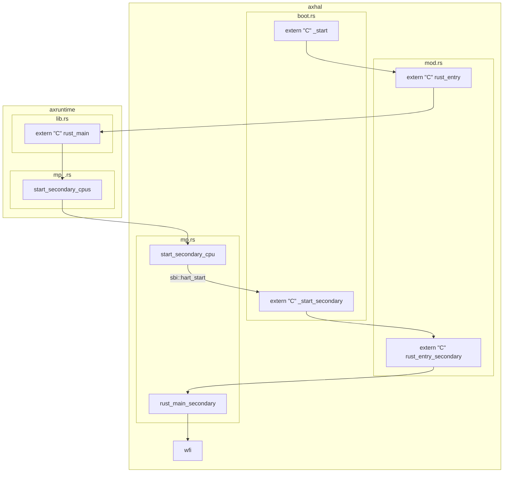
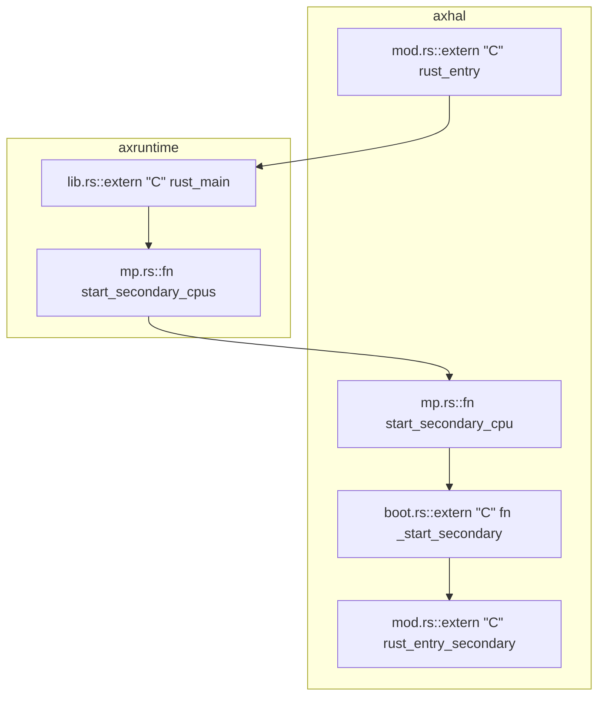

# 0. tmp

```bash
make ARCH=riscv64 A=apps/hv HV=y SMP=2 LOG=debug MODE=debug debug
```

# 1. 基础设施

- [x] vsc debug
- [ ] vsc-ra跳转/识别


# 2. arceos SMP启动过程

好东西-->https://mermaid.live/




[](https://mermaid.live/edit#pako:eNqVU8tuwyAQ_BVre3UiG9t5UKmHttee2lPjyiI2CZYMuBiUpFH-veC8bCVKUyTEDjvs7C6whVwWFDAsKrnKGVHa-3hORardbMx8qUjNPLJmpPJS4R3GycFlMVTN2cHCGV1rqoT38G2kfnzZL54yjc6o0Grz1SHHf5GzhuZSFKR3jIrCJncll7qfCpo12tZzjpHltenKJ7NWiZNS_EtoLqXuSwXXC8naBLqS0S3iPUkwOlstyo7f3VOHw4LB4ImFbpeF1lR7Ew0GKTTzEmPWCjm5FBw1av2RM-NDiNiB5AASB6gL33sPyghdcnqlO1U57zXHDXXrWbj-33W92UVcHl674-YiWrdDyrWFh3vAHWDo-ODdBB84VTapwv6KraOloBm1tQK2ZkEXxFS2eanYWSoxWr5vRA5YK0N9UNIsGeAFqRqLTF0QTV9LYkvgp92aiE8p-fGIhYC3sAYcBsFwjFAcjdAoQUmIkA8bwDEaToNknEwn4TRA0Sja-fDTBgiGE7s9DuIJmqARiiIfaFFqqd72n7r927tf3ds1zg)

>- [ ] 问题：wfi以后怎么办？
>
>从核在走完启动流程后会wfi，然而不能对已经wfi的hart进行``sbi::hart_start``，会报告``SBI_ERR_ALREADY_AVAILABLE``已经启动。那么如何让从核到指定位置继续运行？


# 3. Linux SMP启动过程


# 00. bin




