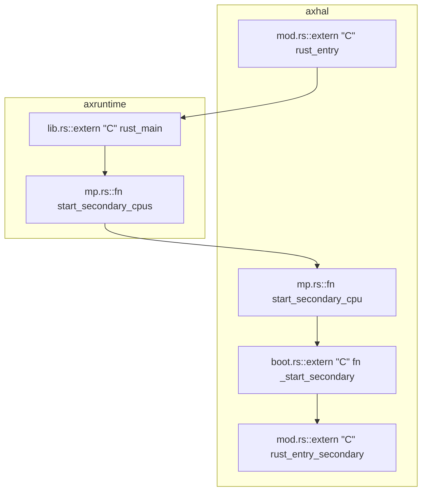
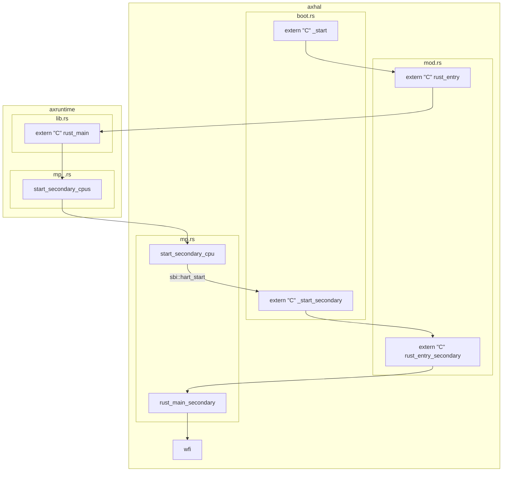

# 0. tmp

```bash
make ARCH=riscv64 A=apps/hv HV=y SMP=2 LOG=debug MODE=debug debug

clear && make ARCH=riscv64 A=apps/hv HV=y SMP=2 LOG=debug MODE=debug run
```

https://github.com/MROS/hypervisor-blog

# 1. 基础设施

- [x] vsc debug
- [ ] vsc-ra跳转/识别

为了方便调试，建议在hypervisor``main``中添加断言，当boot_hart不为0号hart时直接退出。跑通后再支持随机hart的启动。

# 2. arceos SMP启动过程

好东西-->https://mermaid.live/


[](https://mermaid.live/edit#pako:eNqVU8tuwyAQ_BVre3UiG9t5UKmHttee2lPjyiI2CZYMuBiUpFH-veC8bCVKUyTEDjvs7C6whVwWFDAsKrnKGVHa-3hORardbMx8qUjNPLJmpPJS4R3GycFlMVTN2cHCGV1rqoT38G2kfnzZL54yjc6o0Grz1SHHf5GzhuZSFKR3jIrCJncll7qfCpo12tZzjpHltenKJ7NWiZNS_EtoLqXuSwXXC8naBLqS0S3iPUkwOlstyo7f3VOHw4LB4ImFbpeF1lR7Ew0GKTTzEmPWCjm5FBw1av2RM-NDiNiB5AASB6gL33sPyghdcnqlO1U57zXHDXXrWbj-33W92UVcHl674-YiWrdDyrWFh3vAHWDo-ODdBB84VTapwv6KraOloBm1tQK2ZkEXxFS2eanYWSoxWr5vRA5YK0N9UNIsGeAFqRqLTF0QTV9LYkvgp92aiE8p-fGIhYC3sAYcBsFwjFAcjdAoQUmIkA8bwDEaToNknEwn4TRA0Sja-fDTBgiGE7s9DuIJmqARiiIfaFFqqd72n7r927tf3ds1zg)

>- [x] 问题：wfi以后怎么办？
>
>从核在走完启动流程后会wfi，然而不能对已经wfi的hart进行``sbi::hart_start``，会报告``SBI_ERR_ALREADY_AVAILABLE``已经启动。那么如何让从核到指定位置继续运行？
>
>答案是别管，直接侵入arceos部分，直接在wfi-loop前添加函数，让其跳转到新的入口，不进入wfi


# 3. hypervisor虚拟化

## a. cpu虚拟化

arceos启动完成后，跳入hypervisor的``main(hartid)``。hypervisor依次做以下工作：

```rust
// boot cpu
PerCpu::<HyperCraftHalImpl>::init(0, 0x4000);
```

首先为物理cpu创建结构。它会根据cpu数量，获取一块固定大小的内存，并将其按照cpu数量等分，形成类似于一个数组的结构。分配完成后，“数组”的首地址被存入``PER_CPU_BASE``中。

“数组”下标为``cpi_id``的元素存放着对应cpu的信息。这些信息包括cpu_id，栈地址和此物理cpu绑定的vcpu队列等（``marker: core::marker::PhantomData<H>``不懂是干啥的）。

这个结构配合``tp``寄存器，可以在执行流中找到当前的物理cpu信息。在每个物理cpu上执行一次``setup_this_cpu``，就可以让每个cpu的``tp``保存各自的``PerCpu``结构位置。那么在执行流的任意位置使用``this_cpu()``，就能通过``tp``获得当前物理cpu的``PerCpu``结构，进而得到当前运行在几号物理cpu上/此物理cpu绑定哪些vcpu等信息。

然后，hypervisor解析设备树文件，并据此设置两阶段内存转换页表。这部分内容放到内存虚拟化中详细说明。

```rust
// get current percpu
let pcpu = PerCpu::<HyperCraftHalImpl>::this_cpu();

// create vcpu
let gpt = setup_gpm(0x9000_0000).unwrap();
let vcpu = pcpu.create_vcpu(0, 0x9020_0000).unwrap();
```

然后，根据PerCpu创建vcpu，它实际上是在PerCpu的绑定队列里添加``vcpu_id``，然后根据vcpu的id和入口地址，创建一个新vcpu结构。

```rust
pub struct VCpu<H: HyperCraftHal> {
    vcpu_id: usize,
    regs: VmCpuRegisters,
    // gpt: G,
    // pub guest: Arc<Guest>,
    marker: PhantomData<H>,
}
```

vcpu结构最主要的功能是保存V模式/非V模式的寄存器。进入/退出guest时，会对``regs``进行读取/保存。``VCpu<H>::new(...)``会设置一些虚拟化相关寄存器，然后设置``a0/a1/sepc``，构造一个上下文环境，使得在``sret``后可以回到``entry``执行；在hypervisor的main中，这个entry实际上就是linux的入口``0x9020_0000``（因为arceos的启动命令默认会把linux.bin放到这个位置，详情可在make run时使用``-nB``参数打印所有命令查看）。而``a0/a1``需要保存启动hart_id和设备树文件地址，这是riscv linux的规定，它需要接受这些信息才能启动。

>riscv linux 启动文档：
>https://docs.kernel.org/translations/zh_CN/arch/riscv/boot.html

回到main中，创建vcpus，为vcpus添加vcpu，然后根据vcpus和页表创建vm。

```rust
let mut vcpus = VmCpus::new();
// add vcpu into vm
vcpus.add_vcpu(vcpu).unwrap();
let mut vm: VM<HyperCraftHalImpl, GuestPageTable> = VM::new(vcpus, gpt).unwrap();
```

vcpus只是一个聚合多个vcpu的结构，为vm提供一层抽象。而vm在组合了vcpus和页表后，就具备了运行虚拟机的能力。

```rust
vm.init_vcpu(0);

// vm run
info!("vm run cpu{}", hart_id);
vm.run(0);
```

至此，可以启动vm运行guest了。``init_vcpu``会从``vcpus``中获取对应id的vcpu，然后设置其``regs``中的``hgatp``为两阶段转换页表地址，并直接通过``csrw hgatp``写入当前物理cpu的``hgatp``。

>应该如同其他csr一样，``hgatp``在每个hart上都具备。

然后``vm.run``会调用vcpu的``run()``，实际上最后会来到``_run_guest(regs)``。``_run_guest(regs)``是一段汇编，它会保存hypervisor的寄存器到内存（即``regs``内），并替换为``regs``中guest的寄存器值，完成到guest的上下文切换，然后``sret``到之前构造好的linux入口环境中。

此处还会将``stvec``设置为``_guest_exit``，同样为一段汇编，就在``_run_guest``下方。这样做相当于劫“劫持了”arceos的中断向量：本来s mode的trap会进入arceos指定的``stvec``地址，然而此处将其替换为``_guest_exit``地址，使得s mode的trap不再交给arceos的中断处理程序，而是让hypercraft的部分处理中断。

``_guest_exit``类似于做``_run_guest``相反的操作，保存guest上下文，回到hypervisor中。设置``stvec``为``_guest_exit``，可以让linux在``ecall``时，跳转到``_guest_exit``，进而回到host即hypervisor中，而不进入arceos的中断处理程序。

当从``_guest_exit``退出guest后，会回到``vcpu.run()``中，根据``scause``分析原因并进一步退回``vm.run(..)``。``vm.run(...)``根据不同的原因，执行不同的操作，将结果写回``vcpu``的``regs``中，在下一轮``_run_guest``时，这些结果会被linux获知。

在linux kernel眼中，自己就是执行了``ecall``，然后得到了结果而已。它并不清楚``ecall``召唤的原来是hypervisor，也不知道自己的寄存器值已经被换出去一轮了，就好像自己真的在物理cpu上运行一样。而hypervisor的任务就是模拟一个硬件环境，让guest不得而知，自己却能捕捉guest的行为。


> - [x] TODO
> stvec?vstvec?在vs mode即guest os执行ecall后，具体发生了什么？
> 
> stvec仍由hs mode控制，在当前场景下，hypervisor通过替换``stvec``并设置``hideleg/hedeleg``来统领中断处理，替代了原先arceos中断处理的部分。而vstvec完全交由guest os进行处理，在V=1的情况下，guest对``stvec``的读写实际会被导向``vstvec``。
> 
> guest os执行ecall后，会触发hs mode的trap；由于``stvec``被替换为``_guest_exit``，因此会回到host部分，host再经由``scause``获知guest 触发了ecall


## b. 内存虚拟化

两阶段地址翻译：GVA --> GPA --> HPA

其中guest os维护GVA --> GPA这部分转换，hypervisor需要维护GPA --> HPA这部分转换。

首先，arceos在页表初始化时会为虚拟化分配空间，总体为2GB：

```rust
unsafe fn init_boot_page_table() {
    #[cfg(feature = "hv")]
    {
        // 0x0000_0000..0x8000_0000, VRWX_GAD, 2G block
        BOOT_PT_SV39[0] = 0xef;
        BOOT_PT_SV39[1] = (0x40000 << 10) | 0xef;
    }
    // 0x8000_0000..0xc000_0000, VRWX_GAD, 1G block
    BOOT_PT_SV39[2] = (0x80000 << 10) | 0xef;
    // 0xffff_ffc0_8000_0000..0xffff_ffc0_c000_0000, VRWX_GAD, 1G block
    BOOT_PT_SV39[0x102] = (0x80000 << 10) | 0xef;
}
```

然后，hypervisor会从dtb读取地址布局，并建立GPA --> HPA的等值映射，详见``pub fn setup_gpm(dtb: usize) -> Result<GuestPageTable>``

大致布局如下：


缺了mmio的一些映射，大体上应该差不多


## c. 中断虚拟化

以guest os一次设定计时器的操作为例：

1. arceos初始化时设置了虚拟化拓展环境，位于``crates/hypercraft/src/arch/riscv/mod.rs``，其中设置了hideleg，使HS模式的所有中断都委托给了VS模式，也就是guest os所处的模式
2. guest os调用``sbi::set_timer``，设置定时器
3. ecall触发vmexit，此行为被捕获，hypervisor得知guest os调用了``sbi::set_timer``
4. 于是hypervisor调用``sbi::set_timer``，设置了定时器，并使能S模式时钟中断
```rust
HyperCallMsg::SetTimer(timer) => {
    sbi_rt::set_timer(timer as u64);
    // Clear guest timer interrupt
    CSR.hvip.read_and_clear_bits(
        traps::interrupt::VIRTUAL_SUPERVISOR_TIMER,
    );
    //  Enable host timer interrupt
    CSR.sie
        .read_and_set_bits(traps::interrupt::SUPERVISOR_TIMER);
}
```
5. 一段时间后，定时器生效
6. 由于之前设置了hideleg，所有中断都委托给了VS模式；于是guest os触发了时钟中断，并vmexit，此时guest os本身并不知情。

>- [ ] ERROR:
>这部分我觉得有点问题。
>
>首先，中断/异常委托应该会产生委托目标那一级的中断/异常；例如在mideleg将时钟中断委托到s mode，那么当中断来临，pc应该会跑到stvec指示的地址，并且在scause写入原因为s mode时钟中断。那么当hideleg将时钟中断委托到vs mode时，实际上会在vs mode产生一个vs mode虚拟时钟中断？但会经过``vscause``翻译让vs mode认为是触发了s mode时钟中断？如果这样的话，理应会跳转vstvec即guest os的中断处理程序，而不会跳转``stvec``回到host？所以我不太理解为什么hypervisor在``vcpu.rs``能通过``scause``为``SupervisorTimer``，来判断虚拟机获得了时钟中断。
>
>确实有问题，Xideleg并不意味着中断直接到对应的mode了，而是要通过Xip进行注入的。
>https://danielmangum.com/posts/risc-v-bytes-timer-interrupts/#step-0-differentiating-machine-and-supervisor-timer-interrupts


7. 时钟中断被捕获，hypervisor得知guest os遇到了时钟中断
8. 于是hypervisor通过``hvip``向guest os注入中断，并清除S模式中断使能
```rust
VmExitInfo::TimerInterruptEmulation => {
    // debug!("timer irq emulation");
    // Enable guest timer interrupt
    CSR.hvip
        .read_and_set_bits(traps::interrupt::VIRTUAL_SUPERVISOR_TIMER);
    // Clear host timer interrupt
    CSR.sie
        .read_and_clear_bits(traps::interrupt::SUPERVISOR_TIMER);
}
```
9. guest os继续运行，获知发生时钟中断

以上达成的效果是：guest os设置定时器，并在一段时间后获知了时钟中断的发生。

由于替换了``stvec``，因此guest os的异常/中断行为被hypervisor拦截/管控，hypervisor负责将其通知给guest os，称为中断注入。

>todo:
>对吗？


---

这部分比我想的要复杂更多。一个关键困惑是，当时钟中断来临，系统还处在host运行时，不会进入arceos的irq_handler吗？

>见后日谈


# 4. Linux SMP启动过程


[smp多核启动（riscv架构） - 知乎 (zhihu.com)](https://zhuanlan.zhihu.com/p/653590588)


# 5. hypervisor多核

## a. 多核dtb

首先要让guest linux感知到有多核硬件的存在，这部分由设备树文件表示。正常情况下，设备信息应该是由firmware告知操作系统的，而我们现在只需要虚构一个合理的多核硬件平台就行，让guest linux以为真的存在这些硬件。

``/arceos/apps/hv/guest/linux``下已经有了``linux.dtb``和对应的``linux.dts``了，对``.dts``进行修改，给予一个双核心，注意对原文件进行备份。

```
// dts
cpus {
		#address-cells = <0x01>;
		#size-cells = <0x00>;
		timebase-frequency = <0x989680>;

		cpu@0 {
			phandle = <0x01>;
			device_type = "cpu";
			reg = <0x00>;
			status = "okay";
			compatible = "riscv";
			riscv,isa = "rv64ima";
			mmu-type = "riscv,sv39";

			interrupt-controller {
				#interrupt-cells = <0x01>;
				interrupt-controller;
				compatible = "riscv,cpu-intc";
				phandle = <0x02>;
			};
		};

		cpu@1 {
            phandle = <0x05>;
            device_type = "cpu";
            reg = <0x01>;
            status = "okay";
            compatible = "riscv";
            riscv,isa = "rv64ima";
            mmu-type = "riscv,sv39";

            interrupt-controller {
                #interrupt-cells = <0x01>;
                interrupt-controller;
                compatible = "riscv,cpu-intc";
                phandle = <0x06>;
            };
        };

		cpu-map {

			cluster0 {

				core0 {
					cpu = <0x01>;
				};

				core1 {
                	cpu = <0x05>;
           		};
			};
		};
	};
```

使用`dtc`（Device Tree Compiler）将 DTS 文件编译为 DTB 文件。命令格式如下：

```bash
dtc -I dts -O dtb -o output.dtb input.dts

dtc -I dts -O dtb -o linux_hart_x2.dtb linux_hart_x2.dts
```


## b. sbi_call: hart_start

修改``dtb``后运行应该会报错：


```bash
[  0.157032 0 arceos_hv:66] vm run cpu0
[  0.193893 0 hypercraft::arch::vm:221] GetSepcificationVersion: 3
[  0.278965 0 hypercraft::arch::sbi:80] args: [1, 2418020454, 2533225328, 0, 0, 0, 0, 4739917]
[  0.280327 0 hypercraft::arch::sbi:81] args[7]: 0x48534d
[  0.281224 0 hypercraft::arch::sbi:82] EID_RFENCE: 0x52464e43
[  0.282422 0 axruntime::lang_items:5] panicked at 'explicit panic', /arceos_2024/arceos/crates/hypercraft/src/arch/riscv/vm.rs:96:25
[  0.284209 0 axhal::platform::qemu_virt_riscv::misc:3] Shutting down...
```

位置在``hypercraft::arch::sbi:80``的80行，这意味着遇到了未知的sbi_call。

此时应该回到sbi手册，据手册所说：

```
• a7 encodes the SBI extension ID (EID),
• a6 encodes the SBI function ID (FID) for a given extension ID encoded in a7 for any SBI extension defined in or after SBI v0.2.
```

根据以上报错信息，得知``EID = a7 = 0x48533d = 4739917``，``FID = a6 = 0``，查找手册得知对应的内容为``Chapter 9. Hart State Management Extension (EID #0x48534D "HSM")``中的小节``9.1. Function: HART start (FID #0)``。

签名为：
```c
struct sbiret sbi_hart_start(
	unsigned long hartid,
	unsigned long start_addr,
	unsigned long opaque
)
```

此函数要求目标hart以supervisor模式在``start_addr``地址开始运行，并且寄存器会被设置为以下格式（这都是从sbi手册上抄的）：

| Register Name | Register Value   |
| ------------- | ---------------- |
| satp          | 0                |
| sstatus.SIE   | 0                |
| a0            | hartid           |
| a1            | opaque parameter |

其余寄存器不做定义。

可以分析得出，guest linux在知晓第二个核心存在后，就调用``sbi_hart_start(1, 2418020454, 2533225328)``来启动第二个核心，让其从指定地址开始运行。

hypervisor捕获了这一行为，但暂时还没有添加此sbi类型。因此我们需要补齐这部分功能，让hypervisor正确识别``sbi_hart_start``，并做相应处理。

补充这部分功能后，应该能正常进入guest linux了，不过此时多核肯定还没有完成，可以看到开机信息中显示启动cpu失败：

```bash
[    0.046483] smp: Bringing up secondary CPUs ...
[    0.052778] CPU1: failed to start
[    0.054363] smp: Brought up 1 node, 1 CPU
```

毕竟我们还没有真的去运行``sbi_hart_start``中指定位置的代码。guest linux发出了启动hart的请求，却没有收到响应，那么它自然会认为此核心异常，并报告失败。

因此，我们应该启动一个vcpu，遵照上面的状态，让其从指定地址开始运行，给guest linux提供“真的有核心在听我话”的错觉。


## c. secondary运行

最终想要的效果是，当收到主核的``sbi::hart_start``后，根据参数设置寄存器初始状态，然后让第二个hart去运行``vm.run(1)``。

我们需要准备一个新的入口地址``hv_secondary_main``，让第二个hart跳转到此处，好进行下一部分设置。就目前的项目情况看，可以直接修改arceos的``rust_main_secondary``，添加``hv_secondary_main``extern函数调用，让hart直接跳转进去。

在第二个hart进入``hv_secondary_main``后，需要将``PerCpu``结构设置到tp寄存器，并向vm添加新的vcpu，然后进行``vm.init_cpu(1) & vm.run(1)``。

这涉及到一些同步问题。首先，要向vm添加新的vcpu，必须存在vm。这要求主核创建vm以后，从核才调用``vm.add_vcpu(...)``。其次，主核需要等待所有从核都向vm添加vcpu后，才能开始运行``vm.run(0)``，否则开始运行时vcpu数量是缺失的，可能会出问题。

最后，从核需要等待主核调用``sbi::hart_start``，获取目标地址等参数后，才能为vcpu设置对应寄存器，才能正式运行``vm.run(...)``。因此需要一个状态表示vcpu是否可以运行，并且让主核心来控制从核的这个状态。框架代码中包含了``VmCpuStatus``，可以修改后使用：

```rust
pub enum VmCpuStatus {
    /// The vCPU is not powered on.
    #[default]
    PoweredOff,
    /// The vCPU is available to be run.
    Runnable,
    /// The vCPU has benn claimed exclusively for running on a (physical) CPU.
    Running,
}
```

vcpu在运行前需要检查这个状态，来决定是否可以运行，同时主核心应该在处理``sbi::hart_start``时，根据参数设置vcpu寄存器，完成后将vcpu状态设置为可运行。

总体流程差不多是下面这样。目的就是让guest os产生“自己直接运行在硬件上”的错觉。

[](https://mermaid.live/edit#pako:eNp1VF1v2jAU_SuWn0AKEUmcz4dKpau0SStIK93DSIXcxOBIxEGOQ8cQ_32-wQkN65CCOL7nnss9J8kJZ1XOcII3u-o941QqtJylIhVIf-rmbSvpnqNnllUip_K4Bsal2BKcFT-s675a0kK8dt0twR2N3mmhCrFF19OfTyiTVLHxeMD1Vik-lDbN8_Uh2zcjZ5zioRr5TO3Hy3x-P_v-eKPmX9RkIzqhrqRpiom839KZ2JO72jXInWjgGeC1JWIQgZIPfSABV-_QbLFY3pjDW3OMJdfZfdldZZJpF7Qdgy2599mWvcloOKVza7g9J9ftp7c2crDm4X758BXVb0WSgOC6Vvp75FjItu1_GoJVzRSCMQ6SbFsPqyHMgpqtWSCkmnrUp3KrFcHwxXz5bf7yiIZ_8T8BcUf7zk0-3IVIuAmIe1Ay-XDIh_sG-AACAwIAoQEhgKhXbwN3-8A_iAMRwr_Aj7nDhS1cMqnzzfXjcwJOihVnJUtxon_mbEObnUpxKs6aShtVPR9FhhMlG2ZhWTVbjpMN3dUaNftc3wlfCqrvprI_3VPxq6rKrkVDnJzwb5y4vm87JHYdEnqRE3iEWPioj6c20diJvSj0QxLG0dnCf1qFqR37XhyQyI0JIVHk6w6WF6qST5fnv30NnP8CIvAoow)


## d. sbi_call: send_ipi

下面继续运行的话，会出现新的未知sbi_call。


```bash
[  0.339238 0 hypercraft::arch::sbi:88] args: [1, 1, 0, 0, 0, 0, 0, 7557193]
[  0.340591 0 hypercraft::arch::sbi:89] args[7]: 0x735049
[  0.341543 0 hypercraft::arch::sbi:90] EID_RFENCE: 0x52464e43
[  0.343278 0 axruntime::lang_items:5] panicked at 'explicit panic', /arceos_2024S/arceos/crates/hypercraft/src/arch/riscv/vm.rs:128:25
[  0.346961 0 axhal::platform::qemu_virt_riscv::misc:3] Shutting down...
```

这是guest linux的主从核同步过程，主核向从核发送ipi让其跳出wfi。详见linux smp启动过程。

>TODO: linux smp

仿照``hart_start``，在hypervisor中进行处理，真正调用``send_ipi``即可。

根据sbi手册所述，发送核间中断会在目标hart触发一个``supervisor software interrupts``，这会表现为``Unhandled trap: Interrupt(SupervisorSoft)``，需要我们补充相关信息，仿照``vcpu.rs``和``vm.rs``中异常处理的相关内容即可。


## e. 中断注入

收到ipi的hart触发``supervisor software interrupts``后，会跳转中断向量，即在``_run_guest``中被修改为的``_guest_exit``，此时中断被hypervisor捕获，guest os并不知情。

因此我们需要将软件中断注入guest中。

>- [x] TODO
>hvip
>
>群里的蔡存哲老哥也提到了虚拟化中断这块内容，我正好也翻了一遍手册学到了点新东西，贴一手聊天记录摘要。
>
>蔡存哲：Riscv 在 hs 模式往 hvip 注入定時器中斷之後，虛擬機會看到什麼？sip 被設置嗎？那 hip 有什麼作用？看了spec還是不太明白
>
>我：虚拟机视角下应该只有vsip，根据手册中所述，当hideleg设置了时钟中断代理后，vsip.STIP等价于hip.VSTIP。而hip.VSTIP是只读的，它的值为(hvip.VSTIP || 导向VS mode的时钟中断信号)。因此，当hvip被设置后，会反应到hip中，等价于反应到vsip中。我的理解是hip是用来“综合中断信息”的，它表示虚拟机实际有没有中断，即有没有来自hvip的虚拟中断注入，和有没有实际的中断信号
>
>蔡存哲：那當虛擬機去清除 vsip.STIP 時，hvip.VSTIP 是否會跟著被清除？
>蔡存哲：反過來，hvip.VSTIP被hypervisor設置的同時，vsip.STIP是否跟著被設置，抑或是跳入VS mode時vsip.STIP才被跟著設置？Hypervisor感覺可以直接設置vsip.STIP 來注入中斷吧？不明白為何要多透過一個 hvip 來間接注入
>
>我：对os来说，应该不会直接操作sip吧。因为手册提到sip是只读的，是由执行环境设置/清除的。“Bits sip.STIP and sie.STIE are the interrupt-pending and interrupt-enable bits for supervisor level timer interrupts. If implemented, STIP is read-only in sip, and is set and cleared by the execution environment.”
>
>我：这个时机手册似乎没有提到，可能是硬件设置的。理论上只要满足vsip能够正确反应中断状态，什么时候被设置都行
>
>我：这个我也不太懂，可能有个隔离的作用。
https://lists.riscv.org/g/tech-privileged/topic/question_on_the_new_hvip/74064351
有人问过类似的问题，这个回答没太看懂，好像是有关软件保存的问题
>
>蔡存哲：它這個ececution environment 意思比較含糊
>蔡存哲：https://github.com/riscv-non-isa/riscv-sbi-doc/blob/master/src%2Fext-time.adoc
>蔡存哲：OS還是得主動呼叫sbi去清除timer的樣子，不會因為trap進handler，硬體就自動清除pending imterrupt
>
>我：我也不是很懂ececution environment指哪些东西，可能意思是交给M mode去做了，比如sbi。mip倒是能直接管理STIP


>- [ ] 当然，这引出了新的问题，STIP到底是谁在什么时候清除的？这和CLINT的关系又如何？
>
>《RISCV体系结构编程与实践》p.162提到了通过mip+mideleg的方式将时钟中断委托给S mode，直接用mideleg不行吗？


## f. sbi_call: remote fence

后面运行还会触发``RemoteSFenceVMA_ASID``，按照sbi手册内容，仿照之前的内容进行添加即可。


## g. success


```bash
[    0.057543] smp: Bringing up secondary CPUs ...
[    0.061161] cacheinfo: Unable to detect cache hierarchy for CPU 1
[    0.066028] smp: Brought up 1 node, 2 CPUs
```


# 6. 优化/完善

>TODO
>数据竞争风险？上锁？
>中断注入？

~~随机hart启动，启动hart不为0号的情况下~~，会出现模拟外部中断``irq == 0``？在debug_vm_pgtable后面，不知道有没有关系。

```bash
[    1.067972] Key type dns_resolver registered
[    1.101465] debug_vm_pgtable: [debug_vm_pgtable         ]: Validating architecture page table helpers
[  1.420814 0 axruntime::lang_items:5] panicked at 'assertion failed: irq != 0', /arceos_2024S/arceos/crates/hypercraft/src/arch/riscv/vm.rs:250:9
[  1.422409 0 axhal::platform::qemu_virt_riscv::misc:3] Shutting down...
```

所以plic这块是什么情况？

[RISC-V入门（5）- 中断 - 如云泊 (fly0307.github.io)](https://fly0307.github.io/2022/01/04/RISC-V%E5%85%A5%E9%97%A8%EF%BC%885%EF%BC%89-%20%E4%B8%AD%E6%96%AD/)

>- [x] TODO：
>
>为什么读取hart1的claim/complete寄存器能正常工作？
>因为qemu-virt的虽然仿照了FU540，但在PLIC等部分有些许不同，比如FU540的context_0对应hart_0的M mode，context_1对应hart_1的M mode；而qemu-virt将context_0/1分配给了hart_0的M/S mode，因此在qemu-virt部分，hart的S mode对应的contex_id应该为``context_id = vcpu_id * 2 + 1;``


改0x60_0000后爆炸

```bash
[    0.383283] virtio_blk virtio0: blk config size: 96
[  0.646424 0 hypercraft::arch::vm:250] handle_irq vcpu0
[   28.064364] watchdog: BUG: soft lockup - CPU#0 stuck for 26s! [kworker/0:1H:34]
[   28.064790] Modules linked in:
[   28.065099] CPU: 0 PID: 34 Comm: kworker/0:1H Not tainted 6.3.0-rc3-g17214b70a159-dirty #1
[   28.065671] Hardware name: riscv-virtio,qemu (DT)
[   28.066193] Workqueue: kblockd blk_mq_run_work_fn
[   28.066967] epc : __do_softirq+0xac/0x27a
[   28.067349]  ra : __irq_exit_rcu+0xa2/0xd8
[   28.067655] epc : ffffffff8083fade ra : ffffffff80014648 sp : ffffffc80075ba40
[   28.068002]  gp : ffffffff814feab8 tp : ffffffd801920b40 t0 : ffffffff80e03580
[   28.068485]  t1 : 0000000000000004 t2 : 000000000000001f s0 : ffffffc80075bae0
[   28.068892]  s1 : ffffffff81536bb0 a0 : 0000000000000000 a1 : ffffffff80c20f00
[   28.069330]  a2 : 00000000fffedb69 a3 : 00000000fffedb6a a4 : ffffffd806dd2f00
[   28.069650]  a5 : ffffffff80c20f00 a6 : 0000000000000000 a7 : 0000000054494d45
[   28.070006]  s2 : ffffffff81536bb0 s3 : ffffffff8140a080 s4 : 00000000ffffffff
[   28.070333]  s5 : ffffffd801920b40 s6 : 000000000000ffff s7 : ffffffff80c1a448
[   28.070639]  s8 : ffffffc80075bc98 s9 : 0000000000000001 s10: 0000000000000000
[   28.070952]  s11: 0000000000000080 t3 : 000000000000b67e t4 : 00000000eac0c6e6
[   28.071248]  t5 : 0000000400000000 t6 : 00000000eac0c6e6
[   28.071536] status: 0000000200000120 badaddr: 0000000000000000 cause: 8000000000000005
[   28.072111] [<ffffffff8083fade>] __do_softirq+0xac/0x27a
[   28.072954] [<ffffffff80014648>] __irq_exit_rcu+0xa2/0xd8
[   28.073650] [<ffffffff80014770>] irq_exit+0xc/0x1c
[   28.074759] [<ffffffff80837b06>] generic_handle_arch_irq+0x64/0x74
[   28.076253] [<ffffffff80003610>] ret_from_exception+0x0/0x16
[   28.077251] [<ffffffff8036f12c>] blk_mq_do_dispatch_sched+0x1ae/0x28a
[   28.077852] [<ffffffff8036f50a>] __blk_mq_sched_dispatch_requests+0xd4/0x108
[   28.078384] [<ffffffff8036f58e>] blk_mq_sched_dispatch_requests+0x2c/0x56
[   28.078692] [<ffffffff80367484>] __blk_mq_run_hw_queue+0xa6/0xc6
[   28.078918] [<ffffffff803674be>] blk_mq_run_work_fn+0x1a/0x22
[   28.079168] [<ffffffff800265f0>] process_one_work+0x14e/0x26a
[   28.079398] [<ffffffff80026786>] worker_thread+0x7a/0x348
[   28.079667] [<ffffffff8002da78>] kthread+0xbe/0xd0
[   28.079871] [<ffffffff80003610>] ret_from_exception+0x0/0x16
```

```bash
riscv_cpu_do_interrupt: hart:1, async:1, cause:0000000000000003, epc:0xffffffff80120416, tval:0x0000000000000000, desc=m_software
```

m mode软件中断爆炸？


```bash
qemu-system-riscv64 -m 3G -smp 2 -machine virt -bios default -kernel apps/hv/hv_qemu-virt-riscv.bin -device loader,file=apps/hv/guest/linux/linux.dtb,addr=0x90000000,force-raw=on -device loader,file=apps/hv/guest/linux/linux.bin,addr=0x90200000,force-raw=on -drive file=apps/hv/guest/linux/rootfs.img,format=raw,id=hd0 -device virtio-blk-device,drive=hd0 -append "root=/dev/vda rw console=ttyS0"  -nographic -d int -D /tmp/hv_archive6.txt
```


正常情况下，plic应该响应一个8号或10号中断。翻了好一会没找到这两对应的是啥，文档也没找到。最后到qemu仓库里翻到了相关的，和书上写的差不多能对上。  
todo仓库代码链接  
qemu-virt定义中，1-8号是virtio，其中8号是块设备（磁盘吗），10号是uart。不知道我找的对不对（害怕

https://github.com/qemu/qemu/blob/046a64b9801343e2e89eef10c7a48eec8d8c0d4f/include/hw/riscv/virt.h#L91


qemu -d 可以输出日志

https://pdos.csail.mit.edu/6.828/2012/labguide.html
https://pdos.csail.mit.edu/6.828/2012/labguide.html#qemu--d


---

如sbi手册中所说，``clear_ipi()``可以被废弃，直接修改``sip.ssip``可以达到同样效果。

```rust
let mut sip = riscv::register::sip::read().bits();
// debug!("SIP: {:#x}", sip);
let res = sip.set_bit(1, false);
// debug!("Modified SIP {:#x}", res);
riscv::register::sip::write(*res);
// sbi_rt::legacy::clear_ipi();
```

但是项目中rust riscv库的``sip``默认没有``write(...)``方法，只有``read``，有点怪。

库框架中提供了宏，可以很方便的自行添加``write(...)``。

```rust
// /root/.cargo/git/checkouts/riscv-ab2abd16c438337b/11d43cf/src/register/sip.rs
read_csr_as!(Sip, 0x144, __read_sip);

// ADDED
write_csr_as_usize!(0x144, __write_sip);
```


# 7. 进阶任务：多绑定

在一个物理核心上运行多个vcpu。这需要一个切换机制，可以简单选择时钟中断为切换信号。当收到时钟中断后，可以让vcpu/vm以一个特殊``VMExit``信息(???)退出，在hypervisor``main/secondary_main``中，通过``perCpu``的``vcpu_queue``获取其他绑定到此hart的vcpu，对其进行``vm.run(...)``。这要求``vm.run(...)``能够在退出前保存``gprs``，并在下次运行时恢复现场。

```rust
let pcpu = PerCpu::<HyperCraftHalImpl>::this_cpu();
loop {
    let next_vcpu_id = pcpu.next_vcpu();
    vm.init_vcpu(next_vcpu_id);
    vm.run(next_vcpu_id);
}
```

这种情况下，中断要面临的问题更复杂一些。

假设目前只有一个物理cpu，上面要运行两个vcpu。vcpu0作为主核启动了guest linux，在启动过程中，主核会向从核发送ipi，即向vcpu1发送ipi。然而，vcpu0/1都对应同一个物理核，我们不能像单绑定一样，直接对目标核心``sbi::send_ipi``，这等价于自己对自己发ipi。

因此hypervisor在捕获``sbi::send_ipi``行为后，要么立即切换vcpu1运行，要么将此行为缓存下来，等vcpu1运行时再发送？

理论上，所有涉及hart_id的sbi_call都需要进行类似的处理？？？

---


### a. vs寄存器的保存/切换

本来在1：1的情况下，每个vcpu都独占vs csr；这在多绑定情况下失效了，vs csr需要被vcpu们共享。

因此，需要添加对vs csr的load/store。代码中给出了这部分寄存器，但没有使用到，按照框架照猫画虎添加就行了。

加完测试一下能不能跑动就行。


### b. 复用时钟中断

host通过主动设置定时器来管理vcpu的切换。表现为进入``vm.run(...)``后，读取当前时间，并据此设置下一个定时器。

问题在于，guest本身也会设置timer，当时钟中断来临，我们需要判断这是对应谁设置的定时器。这可以通过比较当前时间是否超过目标时间来确定。

此外，``sbi::set_timer(...)``会覆盖上一个定时器，因此当处理完guest timer后，若没有超出时间片，还需重新设置host的timer。


### c. 延迟执行/注入？

如开头所述，由于vcpu不再独占hart，而``sbi_call``又是针对hart执行的，因此需要做特殊处理。

例如，当vcpu0执行``send_ipi(hart_id: 1)``时，并不能直接运行此函数，毕竟此时并没有hart1，而是应该将其缓存到一个类似于``ipi_flag[vcpu_id] = true``的结构中。当vcpu1开始运行时，检查``ipi_flag[1]``标志来确认进入vcpu1虚拟化模式前是否需要``send_ipi(hart_id: 0)``。


### todo. 卡了

折腾过后发现能启动，但启得不是很动，能打印启动信息，显示成功bring up cpu。能够完成``Freeing unused kernel image (initmem) memory``，但是无法运行init。并且有概率卡在``debug_vm_pgtable: [debug_vm_pgtable         ]``。

查看过后疑似qemu卡在了``wfi``，很可能是对应了kernel中的``cpu_do_idle()``。不知道是为什么。

```bash
# qemu monitor显示的pc位置，卡在这了
(qemu) info registers
 V      =   1
 pc       ffffffff80003846


# qemu指令日志显示此处是wfi
----------------
IN: 
Priv: 1; Virt: 1
0xffffffff80003838:  1141              addi            sp,sp,-16
0xffffffff8000383a:  e422              sd              s0,8(sp)
0xffffffff8000383c:  0800              addi            s0,sp,16
0xffffffff8000383e:  0ff0000f          fence           iorw,iorw
0xffffffff80003842:  10500073          wfi             
0xffffffff80003846:  6422              ld              s0,8(sp)
0xffffffff80003848:  0141              addi            sp,sp,16
0xffffffff8000384a:  8082              ret             

```


```c
// 这与cpu_do_idle对应上了
// arch/riscv/include/asm/cpuidle.h
static inline void cpu_do_idle(void)
{
	/*
	 * Add mb() here to ensure that all
	 * IO/MEM accesses are completed prior
	 * to entering WFI.
	 */
	mb();
	wait_for_interrupt();
}

// arch/riscv/include/asm/barrier.h
#define mb()		RISCV_FENCE(iorw,iorw)

// arch/riscv/include/asm/processor.h
static inline void wait_for_interrupt(void)
{
	__asm__ __volatile__ ("wfi");
}

// 这与以上的指令序列可以说完全一致
```


其次，根据vmexitinfo，可能是在``kernel_init()-->mark_readonly()-->mark_rodata_ro()``前出了问题，因为``mark_rodata_ro()``中会执行``remotefence``。在正常的启动记录里，是有这个的；然而当前却没有。

```bash
# 正常情况
[    2.041491] Freeing unused kernel image (initmem) memory: 2188K
[  2.212351 0 hypercraft::arch::vm:111] vm exit info: Ecall(
    Some(
        RemoteFence(
            RemoteSFenceVMA {
                hart_mask: 3,
                hart_mask_base: 0,
                start_addr: 0,
                size: 18446744073709551615,
            },
        ),
    ),
)
[  2.215741 0 hypercraft::arch::vm:117] vm exit info: TimerInterruptEmulation
[  2.217631 0 hypercraft::arch::vm:111] vm exit info: Ecall(
    Some(
        RemoteFence(
            RemoteSFenceVMA {
                hart_mask: 3,
                hart_mask_base: 0,
                start_addr: 0,
                size: 18446744073709551615,
            },
        ),
    ),
)
[  2.221101 0 hypercraft::arch::vm:117] vm exit info: TimerInterruptEmulation
[    2.052317] Run /sbin/init as init process
[  2.224684 0 hypercraft::arch::vm:117] vm exit info: TimerInterruptEmulation
[  2.225846 0 hypercraft::arch::vm:111] vm exit info: Ecall(
    Some(
        SPI(
            SEND_IPI {
                hart_mask: 1,
                hart_mask_base: 1,
            },
        ),
    ),
)
```


```bash
# 异常情况
[    8.050526] Freeing unused kernel image (initmem) memory: 2188K
[  8.290765 0 hypercraft::arch::vm:231] VCPU0 exit info: Ecall(
    Some(
        SPI(
            SEND_IPI {
                hart_mask: 1,
                hart_mask_base: 1,
            },
        ),
    ),
)
[  8.292385 0 hypercraft::arch::vm:231] VCPU1 exit info: SoftInterruptEmulation
[  8.293172 0 hypercraft::arch::vm:434] VCPU1 software emulation
[  8.297410 0 hypercraft::arch::vm:231] VCPU1 exit info: TimerInterruptEmulation
[  8.303414 0 hypercraft::arch::vm:231] VCPU0 exit info: TimerInterruptEmulation
[  8.309629 0 hypercraft::arch::vm:231] VCPU1 exit info: TimerInterruptEmulation
[  8.315812 0 hypercraft::arch::vm:231] VCPU0 exit info: TimerInterruptEmulation
[  8.322230 0 hypercraft::arch::vm:231] VCPU1 exit info: TimerInterruptEmulation
[  8.328517 0 hypercraft::arch::vm:231] VCPU0 exit info: TimerInterruptEmulation
[  8.335044 0 hypercraft::arch::vm:231] VCPU1 exit info: TimerInterruptEmulation
[  8.341418 0 hypercraft::arch::vm:231] VCPU0 exit info: TimerInterruptEmulation
[  8.347521 0 hypercraft::arch::vm:231] VCPU1 exit info: TimerInterruptEmulation
```


```c
// arch/riscv/mm/init.c
void mark_rodata_ro(void)
{
	set_kernel_memory(__start_rodata, _data, set_memory_ro);
	if (IS_ENABLED(CONFIG_64BIT))
		set_kernel_memory(lm_alias(__start_rodata), lm_alias(_data),
				  set_memory_ro);

	debug_checkwx();
}

// arch/riscv/mm/pageattr.c
static int __set_memory(unsigned long addr, int numpages, pgprot_t set_mask,
			pgprot_t clear_mask)
{
	int ret;
	unsigned long start = addr;
	unsigned long end = start + PAGE_SIZE * numpages;
	struct pageattr_masks masks = {
		.set_mask = set_mask,
		.clear_mask = clear_mask
	};

	if (!numpages)
		return 0;

	mmap_write_lock(&init_mm);
	ret =  walk_page_range_novma(&init_mm, start, end, &pageattr_ops, NULL,
				     &masks);
	mmap_write_unlock(&init_mm);

	flush_tlb_kernel_range(start, end);

	return ret;
}

// arch/riscv/include/asm/tlbflush.h
static inline void flush_tlb_kernel_range(unsigned long start,
	unsigned long end)
{
	flush_tlb_all();
}

// arch/riscv/mm/tlbflush.c
void flush_tlb_all(void)
{
	sbi_remote_sfence_vma(NULL, 0, -1);
}

```


是哪没搞好捏，感觉烂尾了


# 99. doing: plic

观察到一个现象：qemu-virt plic的claim/complete寄存器会在读取后自动清0，不知道是不是qemu的实现而已，手册中没有见到相关内容：


不过这确实算有问题吗？不管这个0一样可以正常运行。

plic手册也提到0就是没有待处理中断而已：

```
The PLIC can perform an interrupt claim by reading the claim/complete register, which returns the ID of the highest priority pending interrupt or zero if there is no pending interrupt.
```

别扭的地方只在于有了外部中断却不知道是谁发起的，无视这一点会对系统产生什么影响？


# ?. 后日谈

到做hypercraft重构的时期我才差不多完全明白了它的设计。

做了以下两步操作，才让vm_exit完全在vmm进行处理。

1. 关闭sstatus.sie
2. 进入虚拟机前替换stvec为_guest_exit

这样造成的效果是：当系统处于HS mode的vmm时，由于sstatus.sie是关闭的，因此它不会响应中断。当系统处于vm时，由于VS/VU mode特权级比HS mode低，因此sstatus.sie被视为永久开启，此时中断会被响应，并进入stvec = _guest_exit回到vmm中。


# 00. /bin







